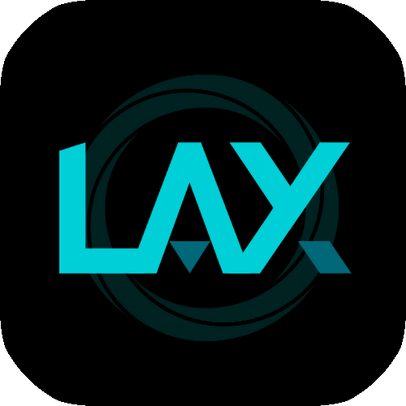

# :globe_with_meridians: LAX

LAX (Language-based Ai Communication System)

# Demo


# Usage

Latest publish [Release beta v0.1.0](https://github.com/feast107/LAX/releases/tag/beta)

+ using `LAX.Server.SignalR` with Dependency injection

  ``` csharp
  IServiceCollection collection;
  collection.AddLAXSignalR(new Gpt35AsyncCommunicator()
  {
      ApiKey = "your api key",
      ModelName = "gpt-3.5-turbo",
      Temperature = 0
  });

  ...

  WebApplication app;
  app.MapLAXHub("/pattern");
  ```

+ using `LAX.Client` of signalR client

  ``` csharp
  ILAXClient client = new LAXSignalRClient(url)
  {
      Identifier = "Your Identifier",
      Description = "Describe your self"
  };
  client.OnReceiveOperation += reply => { OnReceive(reply); };
  await client.StartAsync();
  client.Send(message);
  ```

# Core

Define a set of semantic-based wrappers and unpacks which allows client messages to pass through more AI layers unconsciously

They may contains

+ Risk control
+ Scheduling
+ Authentication

`Dynamic proxy` enable AI to intervene in every link.

# Structure

+ [`Abstraction`](./LAX/LAX.Abstraction/) Interfaces that define how to communicate and transform messages.
+ `Operation`
  + [`Operation`](./LAX/LAX.Operation/) Implements of message transformations.
+ `Communication`
  + [`Communication`](./LAX/LAX.Communication/) Implements of communication with AI.
+ `Execution`
  + [`Client`](./LAX/LAX.Client/) Client behaviors
  + [`Console`](./LAX/LAX.Console/) Demo
  + [`Desktop.Wpf`](./LAX/LAX.Desktop.Wpf/) Desktop
  + [`Server`](./LAX/LAX.Server/) SignalR server
