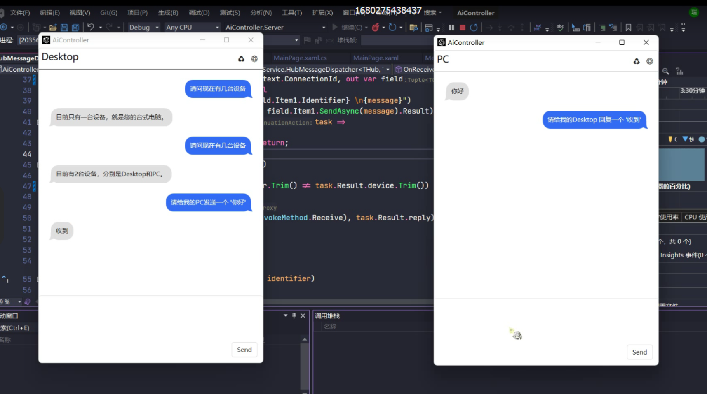

# :globe_with_meridians: LAX
LAX (Language-based Ai Control System)

# Demo

# Run
+ Build and run [`LAX.Server`](./LAX/LAX.Server/)

+ Build and run [`LAX.Console`](./LAX/LAX.Console/)

# Core
Define a set of semantic-based wrappers and unpacks which allows client messages to pass through more AI layers unconsciously

They may contains
+ Risk control
+ Scheduling
+ Authentication

`Dynamic proxy` enable AI to intervene in every link.

# Structure
+ [`Abstraction`](./LAX/LAX.Abstraction/) Interfaces that define how to communicate and transform messages.
+ `Operation`
  + [`Operation`](./LAX/LAX.Operation/) Implements of message transformations.
+ `Communication`
  + [`Communication`](./LAX/LAX.Communication/) Implements of communication with AI.
+ `Execution`
  + [`Client`](./LAX/LAX.Client/) Client behaviors
  + [`Console`](./LAX/LAX.Console/) Demo
  + [`Desktop.Wpf`](./LAX/LAX.Desktop.Wpf/) Desktop
  + [`Server`](./LAX/LAX.Server/) SignalR server